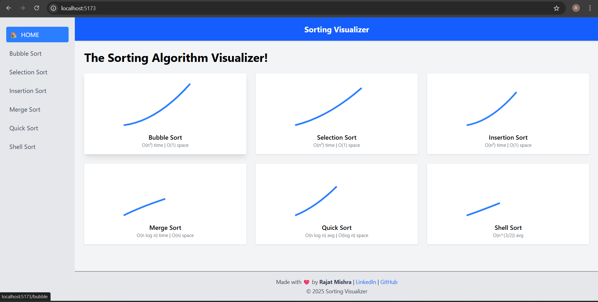
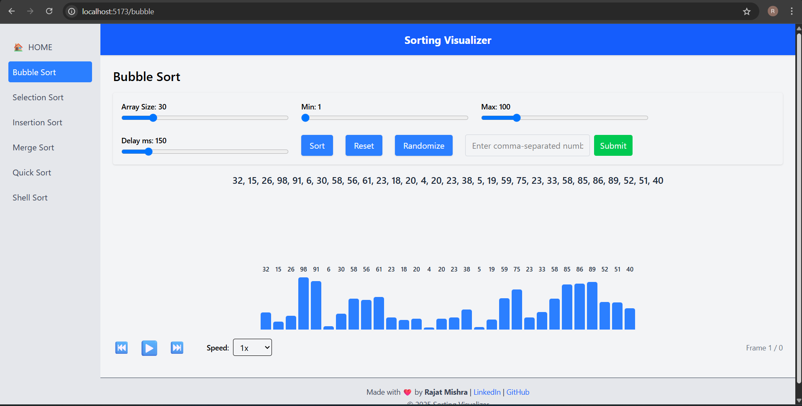

# 🧠 Sorting Algorithm Visualizer

An interactive, responsive web app to visualize how different sorting algorithms work in real-time. Built using **React** and styled with **Tailwind CSS**, this project helps learners and developers understand sorting through intuitive animations and controls.

### 🔗 Live Demo  
👉 [Visit the Website](https://sorting-visualizer-nine-blush.vercel.app/)

---

## 📸 Preview

### 🏠 Home Page

### 📊 Sorting in Action

---

## ✨ Features

- 🔢 Visualize multiple sorting algorithms:
  - Bubble Sort
  - Selection Sort
  - Insertion Sort
  - Merge Sort
  - Quick Sort
  - Shell Sort
- 🎛️ Fully interactive control panel:
  - Adjust array size
  - Set custom min/max range
  - Control animation delay
  - Play, pause, step forward/backward
  - Input custom array manually
- 🎨 Responsive layout with clean design
- 🔄 Dynamic comparisons shown during sorting

---

## 📚 Tech Stack

- **Frontend**: React + Vite
- **Styling**: Tailwind CSS
- **Routing**: React Router DOM

---

## 🙋‍♂️ Author  
Made with ❤️ by **Rajat Mishra**

- 🔗 [LinkedIn](https://www.linkedin.com/in/rajat-mishra-69b473257/)
- 🐙 [GitHub](https://github.com/rajat-mish)

